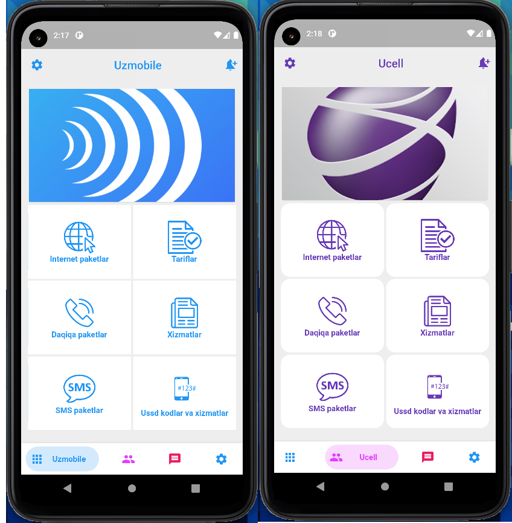
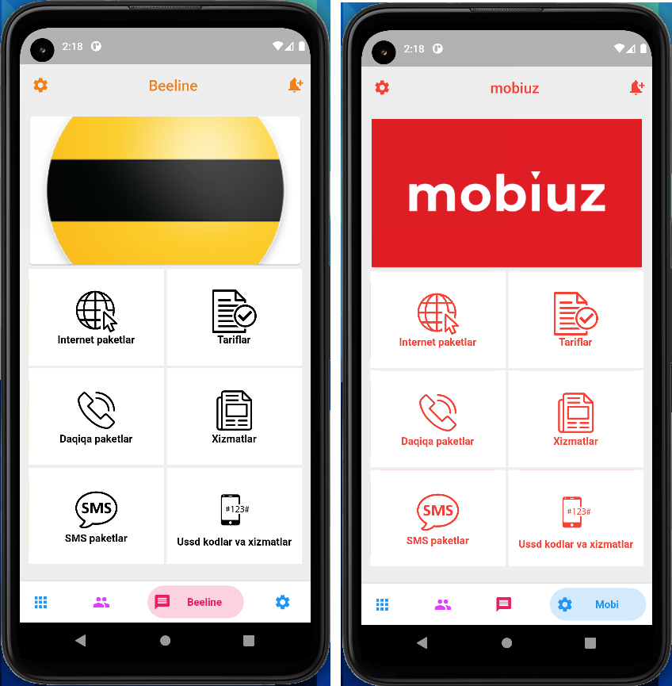

# Flutter ArisUssd Application



## Getting Started

```dart
$ git clone https://github.com/ariscybertech/aris_ussd.git
$ flutter packages get
```

Run the application and enjoy :tada: :rainbow::heart:

# Description
:grinning:Unstructured Supplementary Service Data or USSD in short is a service that allows mobile phone users to interact with a remote application from their device in real time. A predefined session is started once a user dials in to facilitate the transfer of information between your application and the user. It is a highly scalable service as it does not require an internet connection and is supported by both feature and smartphones:tv::telephone::phone::camera::iphone: